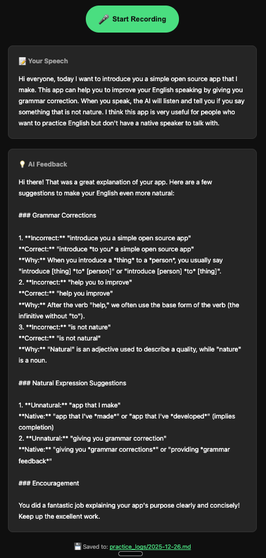
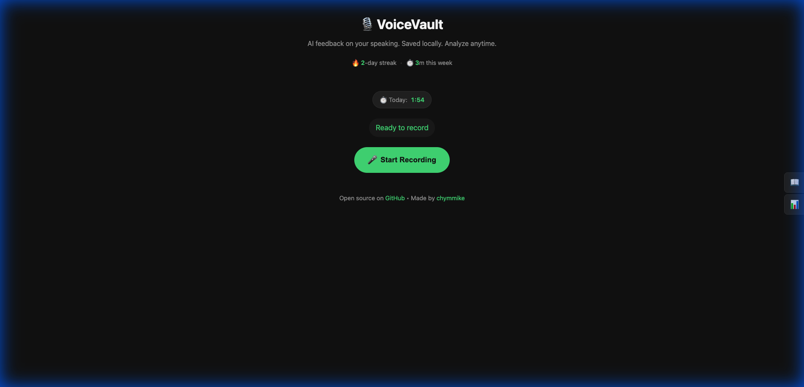
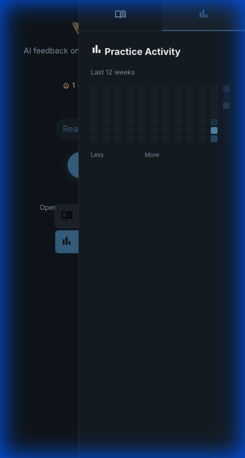

#  VoiceVault

**AI feedback on your speaking. Saved locally. Analyze anytime.**

A local-first English speaking practice app. Record yourself, get instant AI corrections, and own all your data as Markdown files.

## 🎯 Visual Showcase

### 1. Instant AI Feedback
Direct, formatted corrections on your grammar, vocabulary, and naturalness.



### 2. Distraction-Free Recording
Clean, dark-mode interface designed for focus.



### 3. Long-term Tracking
GitHub-style heatmap and streak tracking to keep you motivated.



---

## ✨ Features

### Core
- 🎤 **Voice Recording** — Record directly in browser, no installs needed
- 🤖 **AI Feedback** — Gemini 2.5 Flash (free tier) provides **formatted Markdown feedback** with grammar corrections + natural expression suggestions
- 📝 **Markdown Logs** — All sessions saved as local `.md` files （AI-friendly)

### Experience
- 🎨 **Distraction-Free UI** — Elegant dark mode with gold accents, designed for focus (resembling a premium blog aesthetic)
- ⚡ **Low Friction** — "Ready to record" in seconds, minimized clicks
- 📱 **Responsive** — Works on desktop and tablet sizes

### Stats & Analytics
- 🔥 **Streak Tracking** — See your consecutive practice days
- 📊 **12-Week Heatmap** — GitHub-style activity visualization
- ⏱️ **Practice Timer** — Live recording timer + daily totals

### Tools
- 📖 **Dictionary Lookup** — Search definitions, phonetics, and play pronunciations (Side Panel)
- 💾 **One-Click Open** — Click "Saved to" to open your logs folder

---

## 🚀 Quick Start

### ⚠️ Python Version

**Requires Python 3.9 or 3.10** — Whisper has compatibility issues with 3.11+.

**macOS/Linux** — Use [pyenv](https://github.com/pyenv/pyenv):
```bash
pyenv install 3.10.14
pyenv local 3.10.14
```

**Windows** — Use [pyenv-win](https://github.com/pyenv-win/pyenv-win) or download from [python.org](https://www.python.org/downloads/release/python-31014/).

### 1. Clone & Install

```bash
git clone https://github.com/chymmike/VoiceVault.git
cd VoiceVault

# Create virtual environment
python -m venv venv
source venv/bin/activate  # Windows: venv\Scripts\activate

# Install dependencies
pip install -r requirements.txt
```

### 2. Configure API Key

```bash
cp .env.example .env
# Edit .env and add your Gemini API key
```

Get your free API key: https://aistudio.google.com/app/apikey

### 3. Run

```bash
python app.py
```

Open http://localhost:5001 in your browser (default port might vary).

**For development (with hot reload):**
```bash
FLASK_DEBUG=1 python app.py
```

---

## 📁 Project Structure

```
VoiceVault/
├── app.py              # Flask backend
├── requirements.txt    # Python dependencies
├── .env.example        # API key template
├── static/
│   ├── images/         # Logos and icons
│   ├── fonts/          # Self-hosted fonts (Material Symbols)
│   ├── screenshots/    # README assets
│   ├── index.html      # Frontend UI
│   ├── style.css       # Styling
│   └── script.js       # Recording + UI logic
└── practice_logs/      # Your Markdown logs (gitignored)
```

---

## 🔒 Privacy

- **Whisper runs locally** — Your voice never leaves your machine
- **Logs stay local** — All practice sessions stored as local Markdown files
- **No tracking** — No analytics, no cookies, no user accounts

Only transcripts are sent to Gemini API for feedback.

> ⚠️ **Gemini API key is required** — Without it, you won't receive AI feedback (the core feature).

---

## 🛠️ Tech Stack

| Component | Technology |
|-----------|------------|
| Speech-to-Text | [OpenAI Whisper](https://github.com/openai/whisper) (local) |
| AI Feedback | [Google Gemini](https://ai.google.dev/) |
| Backend | Flask (Python) |
| Frontend | Vanilla HTML/CSS/JS |
| Formatting | [marked.js](https://marked.js.org/) |
| Dictionary | [Free Dictionary API](https://dictionaryapi.dev/) |

---

## 📝 License

[MIT](LICENSE) — Use freely, attribution appreciated.

---

## 🙋 Author

Made by [chymmike](https://www.chymmike.com/) • [GitHub](https://github.com/chymmike)
